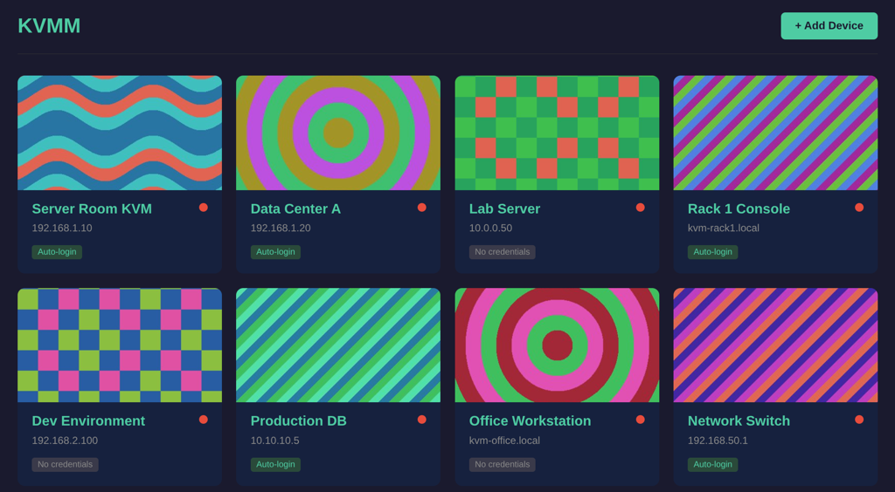

# KVMM - KVM Manager



:sparkles: vibe coded :sparkles:

## Run

```bash
docker run -d -p 8080:8080 \
  -v ./config.toml:/config.toml \
    ghcr.io/rothgar/kvmm:latest \
      server -config /config.toml
```
Open your web browser http://localhost:8080 or use the CLI

```
docker run --rm -t \
  -e KVMM_SERVER=http://localhost:8080 \
    ghcr.io/rothgar/kvmm:latest \
      list
```

## Usage

```bash
# Start the web server
kvmm server -config config.toml

# List all devices (connects to running server)
kvmm list

# Open a device by alias (opens in browser)
kvmm "Server Room"

# Open by hostname
kvmm 192.168.1.100
```

## CLI Configuration

```bash
export KVMM_SERVER=http://192.168.1.50:8080
kvmm list
```
Config file is automatically read from `~/.config/kvmm.conf`

```
server = http://192.168.1.50:8080
```

## Server Configuration

```toml
[server]
port = 8080

[[devices]]
host = "192.168.1.100"
alias = "Server Room KVM"
username = "admin"
password = "secret"

[[devices]]
host = "kvm2.local"
alias = "Office KVM"
# no credentials - opens without auto-login
```

## API Endpoints

| Method | Endpoint | Description |
|--------|----------|-------------|
| GET | `/` | Web UI |
| GET | `/api/devices` | List all devices |
| POST | `/api/devices` | Add new device |
| PUT | `/api/devices/{id}` | Update device |
| DELETE | `/api/devices/{id}` | Remove device |
| GET | `/api/status` | Device reachability status |
| GET | `/go/{id}` | Redirect to KVM with credentials |

## License

MIT
